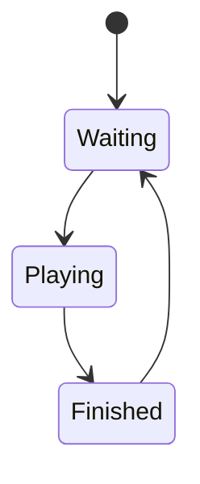

# <game> 設計書

この文書は**現在の実装**を説明する。実装を変更したら同じ PR で更新する。

## 概要

- ゲームの目的:
- プレイヤー数:
- 進行単位:
- 特殊仕様:

## 実装ファイル

### Frontend

| 種別 | ファイル |
| --- | --- |
| page | `frontend/src/pages/<game>/[roomId].tsx` |
| room hook | `frontend/src/features/<game>/use<Game>Room.ts` |
| reducer | `frontend/src/features/<game>/reducer.ts` |
| types | `frontend/src/features/<game>/types.ts` |
| tests | `frontend/src/features/<game>/reducer.test.ts` |
| components | `frontend/src/features/<game>/components/` |

### Backend

| 種別 | ファイル |
| --- | --- |
| room creation | `backend/src/main/java/com/boardgame/app/controller/MainController.java` |
| common controller | `backend/src/main/java/com/boardgame/app/controller/GameController.java` |
| game controller | `backend/src/main/java/com/boardgame/app/controller/<Game>Controller.java` |
| room entity | `backend/src/main/java/com/boardgame/app/entity/<game>/<Game>Room.java` |
| user entity | `backend/src/main/java/com/boardgame/app/entity/<game>/<Game>User.java` |
| constants | `backend/src/main/java/com/boardgame/app/constclass/<game>/` |

## 状態モデル

### Backend State

| フィールド | 意味 |
| --- | --- |
| `userList` | 参加ユーザー |

### Frontend State

| 分類 | フィールド | 意味 |
| --- | --- | --- |
| room | `playerName` | 自分の名前 |
| message | `messageList` | ローカル表示メッセージ |
| game |  |  |
| view |  |  |

## 通信

### 接続

- REST:
- STOMP endpoint: `{AP_HOST}boardgame-endpoint`
- subscribe topic:

### Client -> Server

| 操作 | destination | status | payload obj | backend |
| --- | --- | --- | --- | --- |
| 入室 |  |  |  |  |

### Server -> Client

| status | payload | reducer の反映 | UI への影響 |
| --- | --- | --- | --- |
| `100` |  |  |  |

## 状態遷移

## 副作用・UI 表示

| トリガ | 実装 | 内容 |
| --- | --- | --- |
|  |  |  |

## 注意点

- 

## テスト・確認観点

- reducer test:
- 手動確認:

