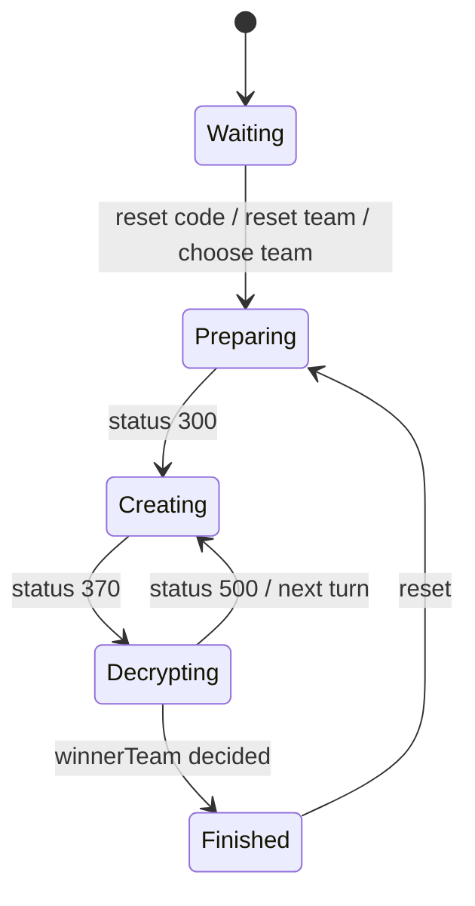

# decrypt 設計書

この文書は**現在の実装**を説明する。実装を変更したら同じ PR で更新する。

## 概要

Decrypt は左右2チームで暗号を作成・解読し、成功チップと失敗チップで勝敗を決めるゲーム。

- 最大人数: 16
- 開始条件: 左右チームそれぞれ2人以上
- topic: `/topic/{roomId}`
- サーバ状態の正本: `DecryptRoom`
- フロント状態の入口: `decryptReducer`

## 実装ファイル

### Frontend

| 種別 | ファイル |
| --- | --- |
| page | `frontend/src/pages/decrypt/[roomId].tsx` |
| room hook | `frontend/src/features/decrypt/useDecryptRoom.ts` |
| reducer / state | `frontend/src/features/decrypt/reducer.ts`, `frontend/src/features/decrypt/types.ts` |
| tests | `frontend/src/features/decrypt/reducer.test.ts` |
| components | `frontend/src/features/decrypt/components/` |

### Backend

| 種別 | ファイル |
| --- | --- |
| room creation | `backend/src/main/java/com/boardgame/app/controller/MainController.java` |
| common controller | `backend/src/main/java/com/boardgame/app/controller/GameController.java` |
| game controller | `backend/src/main/java/com/boardgame/app/controller/DecryptController.java` |
| room / user | `backend/src/main/java/com/boardgame/app/entity/decrypt/DecryptRoom.java`, `DecryptUser.java` |
| team / turn | `TeamData.java`, `TurnData.java` |
| constants | `backend/src/main/java/com/boardgame/app/constclass/decrypt/DecryptConst.java` |

## 状態モデル

### Backend State

| フィールド | 意味 |
| --- | --- |
| `userList` | 参加ユーザー。`teamNo` と `cryptUserFlg` を持つ |
| `turn` | 解読ターン。偶奇で対象チームが切り替わる |
| `gameTime` | `TIME_FIRST` / 作成者決定 / 暗号作成 / 解読 / 終了などの進行状態 |
| `choiceMode` | 暗号作成者の選び方。ランダムまたは挙手 |
| `winnerTeam` | 勝利チーム。引き分け値もあり |
| `leftTeam` / `rightTeam` | チームごとのコードワード、turnData、成功・失敗チップ |

### Frontend State

| 分類 | フィールド |
| --- | --- |
| room | `playerName`, `playerData` |
| message | `messageList`, `chatList` |
| game | `userList`, `gameTime`, `turn`, `choiceMode`, `winnerTeam`, `leftTeam`, `rightTeam` |
| view | `startFlg` |

`playerData` は `userList` 内に自分が見つかった時だけ更新する keep-last 方式。

## 通信

### 接続

- REST: `GET {AP_HOST}createroom/decrypt`
- STOMP endpoint: `{AP_HOST}boardgame-endpoint`
- subscribe topic: `/topic/{roomId}`

### Client -> Server

| 操作 | destination | status | payload obj | backend |
| --- | --- | --- | --- | --- |
| 入室 | `/app/game-roomin` | `100` | `null` | `GameController.gameRoomIn` |
| チャット | `/app/game-chat` | `101` | `null` | `GameController.chat` |
| 暗号リセット | `/app/decrypt-resetcode` | `110` | `null` | `DecryptController.decryptResetCode` |
| チームリセット | `/app/decrypt-resetteam` | `120` | `null` | `DecryptController.decryptResetTeam` |
| チーム選択 | `/app/decrypt-choiceteam` | `130` | team no | `DecryptController.decryptchoiceTeam` |
| モード変更 | `/app/decrypt-modechange` | `140` | mode no | `DecryptController.decryptModeChanee` |
| ゲーム開始 | `/app/decrypt-init` | `300` | `null` | `DecryptController.decryptInit` |
| 暗号作成者に立候補 | `/app/decrypt-handupcreatecode` | `350` | `null` | `DecryptController.decryptHandUpCreateCode` |
| 暗号作成 | `/app/decrypt-createcodeword` | `370` | word list | `DecryptController.decryptCreateCodeWord` |
| 解読 | `/app/decrypt-decryptcode` | `500` | number list | `DecryptController.decryptDecryptCode` |
| 制限時間変更 | `/app/game-setlimittime` | `550` | limit time | `GameController.setLimitTime` |
| 時間切れ処理 | `/app/game-dooverLimit` | `600` | turn | `GameController.doOverLimit` |
| アイコン変更 | `/app/game-changeIcon` | `650` | icon URL | `GameController.changeIcon` |

### Server -> Client

| status | payload | reducer の反映 | UI への影響 |
| --- | --- | --- | --- |
| `100` | `DecryptRoom` | `dataSet` | 入室・チーム状態更新 |
| `101` | `chatList` | `chatList` 更新 | チャット欄更新 |
| `110` | `DecryptRoom` | `dataSet` | コードワード更新 |
| `120` | `DecryptRoom` | `dataSet` | チーム割り当て更新 |
| `130` | `DecryptRoom` | `dataSet` | チーム選択反映 |
| `140` | `DecryptRoom` | `dataSet` | 作成者選択モード反映 |
| `200` | `DecryptRoom` + message | `dataSet`、`messageList` 追記 | 同一名入室メッセージ |
| `300` | `DecryptRoom` | `startFlg=true`、`dataSet` | 開始 overlay |
| `350` | `DecryptRoom` | `dataSet` | 暗号作成者更新 |
| `370` | `DecryptRoom` | `dataSet` | 暗号作成完了 |
| `404` | message | `messageList` 追記 | エラー表示 |
| `500` | `DecryptRoom` | `dataSet` | 解読結果・ターン進行 |
| `650` | `userList` | `userList` のみ更新 | アイコン反映 |
| `998` | message | `userName` が自分なら `messageList` 追記 | 個人エラー |
| `999` | message | `messageList` 追記 | 全体エラー |

## 状態遷移

## 副作用・UI 表示

| トリガ | 実装 | 内容 |
| --- | --- | --- |
| `startFlg` | `useDecryptRoom.ts` | 一定時間後に `dismissStart` |
| `chatList` | `useDecryptRoom.ts` | チャット欄を下までスクロール |
| own user 検出 | reducer / hook | `playerData` 更新、初期アイコン自動設定 |

## 注意点

- `choiceMode` により、開始後に暗号作成者をランダム選出するか、挙手で選ぶかが変わる。
- `playerData` は自分が `userList` に見つからない場合は前回値を維持する。
- `useDecryptRoom` には status `550` / `600` の制限時間系送信口があるが、`DecryptRoom` は現在 `LimitTimeInterface` を実装していない。UI から利用する前に backend 側の対応状況を確認する。

## テスト・確認観点

- `frontend/src/features/decrypt/reducer.test.ts` で主要 status、個人/全体エラー、ローカル action を検証。
- 手動確認は4人以上の複数タブで、チーム分け、暗号リセット、開始、作成者選択、暗号作成、解読、勝敗、チャット、アイコン変更を確認する。
