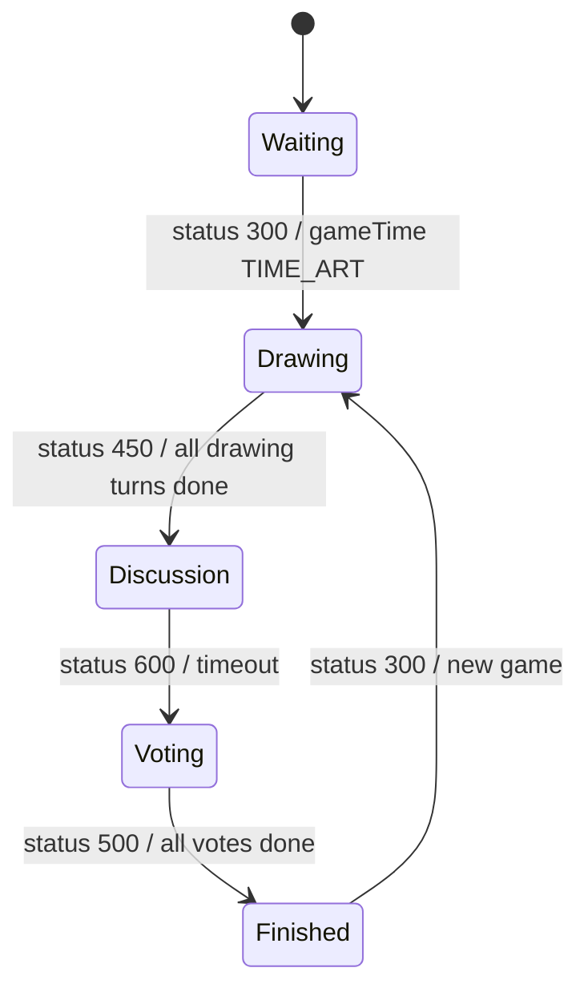

# fakeartist 設計書

この文書は**現在の実装**を説明する。実装を変更したら同じ PR で更新する。

## 概要

Fake Artist は、1人だけテーマを知らないエセ芸術家を含む参加者が順番に絵を描き、議論と投票でエセ芸術家を当てるゲーム。

- 最大人数: 16
- 開始条件: 3人以上、テーマ種類が1つ以上選択されていること
- topic: `/topic/{roomId}`
- サーバ状態の正本: `FakeArtistRoom`
- フロント状態の入口: `fakeartistReducer`

## 実装ファイル

### Frontend

| 種別 | ファイル |
| --- | --- |
| page | `frontend/src/pages/fakeartist/[roomId].tsx` |
| room hook | `frontend/src/features/fakeartist/useFakeartistRoom.ts` |
| reducer / state | `frontend/src/features/fakeartist/reducer.ts`, `frontend/src/features/fakeartist/types.ts` |
| canvas helper | `frontend/src/features/fakeartist/canvasDraw.ts` |
| tests | `frontend/src/features/fakeartist/reducer.test.ts` |
| components | `frontend/src/features/fakeartist/components/` |
| shared types | `frontend/src/type/fakeartist/` |

### Backend

| 種別 | ファイル |
| --- | --- |
| room creation | `backend/src/main/java/com/boardgame/app/controller/MainController.java` |
| common controller | `backend/src/main/java/com/boardgame/app/controller/GameController.java` |
| game controller | `backend/src/main/java/com/boardgame/app/controller/FakeArtistController.java` |
| room / user | `backend/src/main/java/com/boardgame/app/entity/fakeartist/FakeArtistRoom.java`, `FakeArtistUser.java` |
| drawing data | `ArtData.java`, `ArtDataStroke.java` |
| constants | `backend/src/main/java/com/boardgame/app/constclass/fakeartist/FakeArtistConst.java` |

## 状態モデル

### Backend State

| フィールド | 意味 |
| --- | --- |
| `userList` | 参加ユーザー。役職、描画順、投票可否、投票数、処刑 flag を持つ |
| `turn` | 描画ターン。各ユーザーが2回描くまで進む |
| `gameTime` | `TIME_FIRST` / 描画 / 議論 / 投票 / 終了 |
| `theme` | 今回のテーマ |
| `artDataStrokeList` | 全描画 stroke |
| `patternList` | テーマカテゴリ選択 |
| `limitTime` | 議論制限時間 |
| `endMessage` | 投票結果メッセージ |

### Frontend State

| 分類 | フィールド |
| --- | --- |
| room | `playerName`, `playerData` |
| message | `messageList`, `chatList` |
| game | `userList`, `turn`, `gameTime`, `theme`, `endMessage`, `patternList`, `limitTime` |
| canvas | `artDataStrokeList`, `remoteStroke`, `remoteStrokeSeq`, `redrawSeq`, `clearSeq`, `resultSeq` |
| view | `startFlg`, `disscuttionStartFlg`, `votingStartFlg`, `personCanvasZindex`, `endFlg` |

Canvas への描画は reducer では行わず、state の sequence を hook / component の副作用で消費する。

## 通信

### 接続

- REST: `GET {AP_HOST}createroom/fakeartist`
- STOMP endpoint: `{AP_HOST}boardgame-endpoint`
- subscribe topic: `/topic/{roomId}`

### Client -> Server

| 操作 | destination | status | payload obj | backend |
| --- | --- | --- | --- | --- |
| 入室 | `/app/game-roomin` | `100` | `null` | `GameController.gameRoomIn` |
| 退室 | `/app/game-removeuser` | `150` | user name | `GameController.gameRemoveUser` |
| テーマ種類変更 | `/app/fakeartist-setpattern` | `160` | pattern list | `FakeArtistController.setPatternList` |
| チャット | `/app/game-chat` | `101` | `null` | `GameController.chat` |
| 開始 | `/app/fakeartist-init` | `300` | `null` | `FakeArtistController.fakeartistInit` |
| 描画 | `/app/fakeartist-drawing` | `450` | stroke | `FakeArtistController.fakeartistDrawing` |
| 投票 | `/app/fakeartist-voting` | `500` | target username | `FakeArtistController.fakeartistVoting` |
| 制限時間変更 | `/app/game-setlimittime` | `550` | limit time | `GameController.setLimitTime` |
| 時間切れ処理 | `/app/game-dooverLimit` | `600` | turn | `GameController.doOverLimit` |
| アイコン変更 | `/app/game-changeIcon` | `650` | icon URL | `GameController.changeIcon` |

### Server -> Client

| status | payload | reducer の反映 | UI への影響 |
| --- | --- | --- | --- |
| `100` | `FakeArtistRoom` | `dataSet`。自分の入室なら `redrawSeq` と `artDataStrokeList` 更新 | 入室・再描画 |
| `101` | `chatList` | `chatList` 更新 | チャット欄更新 |
| `150` | `FakeArtistRoom` | `dataSet`。自分の退室なら `playerData=null` | 退室反映 |
| `160` | `patternList` | `patternList` 更新 | テーマ種類選択反映 |
| `200` | `FakeArtistRoom` + message | `dataSet`、message 追記。自分なら再描画 | 同一名入室 |
| `300` | `FakeArtistRoom` | `startFlg=true`、`clearSeq+1`、canvas/view reset、`dataSet` | 開始 overlay、canvas clear |
| `404` | message | `messageList` 追記 | エラー表示 |
| `450` | `FakeArtistRoom` | 他人の stroke なら `remoteStrokeSeq+1`。stroke end 時は `dataSet` と全 stroke 更新 | Canvas に遠隔描画、ターン進行 |
| `451` | なし | state 変更なし | 通常描画の no-op 経路 |
| `500` | `FakeArtistRoom` | `dataSet`。`gameTime==4` なら `resultSeq+1` | 投票・結果表示 |
| `550` | limit time | `limitTime` 更新 | 制限時間反映 |
| `600` | `FakeArtistRoom` | `dataSet` | 議論終了・投票移行 |
| `650` | `userList` | `userList` のみ更新 | アイコン反映 |
| `998` | message | `userName` が自分なら `messageList` 追記 | 個人エラー |
| `999` | message | `messageList` 追記 | 全体エラー |

## 状態遷移

## 副作用・UI 表示

| トリガ | 実装 | 内容 |
| --- | --- | --- |
| `startFlg` | `useFakeartistRoom.ts` | 開始表示、ヘッダチェック UI 調整、一定時間後に `dismissStart` |
| `disscuttionStartFlg` | `useFakeartistRoom.ts` | 議論開始表示 |
| `votingStartFlg` | `useFakeartistRoom.ts` | 投票開始表示、ヘッダチェック UI 調整 |
| `remoteStrokeSeq` | canvas component | 他人の最新 stroke を canvas に描画 |
| `redrawSeq` | canvas component | 入室・再入室時に全 stroke を再描画 |
| `clearSeq` | canvas component | ゲーム開始時に canvas clear |
| `resultSeq` | `useFakeartistRoom.ts` | 結果表示タイミングを制御 |
| `chatList` | `useFakeartistRoom.ts` | チャット欄を下までスクロール |
| own user 検出 | reducer / hook | `playerData` 更新、初期アイコン自動設定 |

## 注意点

- `disscuttionStartFlg` は現行 state 名の綴りを維持している。
- fakeartist は canvas の副作用が多いため、reducer は描画そのものを行わず sequence 値だけを更新する。
- `.fakeartistcheck` への DOM 操作が hook に残っている。future 側の DOM 直接操作整理で扱う。
- 描画データは 1000 stroke を超えると backend 側で先頭を削る。

## テスト・確認観点

- `frontend/src/features/fakeartist/reducer.test.ts` で status `100/101/150/160/200/300/450/451/500/550/600/650/998/999`、canvas sequence、ローカル action を検証。
- 手動確認は3人以上の複数タブで、テーマ選択、開始、描画同期、議論移行、投票、結果、再入室時の再描画、チャット、アイコン変更を確認する。
