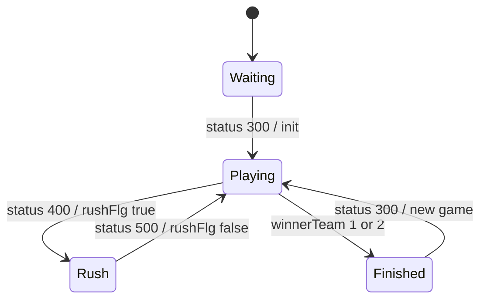

# hideout 設計書

この文書は**現在の実装**を説明する。実装を変更したら同じ PR で更新する。

## 概要

Hideout は、建物に待機したプレイヤーが一定数に達するとラッシュ判定に入り、隊員カードで突入成功・失敗を判定するゲーム。

- 最大人数: 6
- 開始条件: 4人以上
- topic: `/topic/{roomId}`
- サーバ状態の正本: `HideoutRoom`
- フロント状態の入口: `hideoutReducer`

## 実装ファイル

### Frontend

| 種別 | ファイル |
| --- | --- |
| page | `frontend/src/pages/hideout/[roomId].tsx` |
| room hook | `frontend/src/features/hideout/useHideoutRoom.ts` |
| reducer / state | `frontend/src/features/hideout/reducer.ts`, `frontend/src/features/hideout/types.ts` |
| tests | `frontend/src/features/hideout/reducer.test.ts` |
| components | `frontend/src/features/hideout/components/` |

### Backend

| 種別 | ファイル |
| --- | --- |
| room creation | `backend/src/main/java/com/boardgame/app/controller/MainController.java` |
| common controller | `backend/src/main/java/com/boardgame/app/controller/GameController.java` |
| game controller | `backend/src/main/java/com/boardgame/app/controller/HideoutController.java` |
| room / user | `backend/src/main/java/com/boardgame/app/entity/hideout/HideoutRoom.java`, `HideoutUser.java` |
| cards / const | `BuildingCard.java`, `MemberCard.java`, `constclass/hideout/HideoutConst.java` |

## 状態モデル

### Backend State

| フィールド | 意味 |
| --- | --- |
| `userList` | 参加ユーザー。開始時にシャッフルされ、役割・建物・手番が設定される |
| `turn` | ターン番号 |
| `buildingCardList` | 建物カード一覧 |
| `memberCardList` | 隊員カード山 |
| `memberFirldList` | ラッシュ判定中に場へ出た隊員カード |
| `firldBuilding` | 中央の建物カード |
| `waitUserIndexList` | 中央建物に待機しているユーザー index |
| `rushFlg` | ラッシュ判定中か |
| `winnerTeam` | `0`: 未決着、`1`: SWAT、`2`: テロリスト |

### Frontend State

| 分類 | フィールド |
| --- | --- |
| room | `playerName` |
| message | `messageList`, `chatList` |
| game | `userList`, `memberFirldList`, `rushFlg`, `firldBuilding`, `waitUserIndexList`, `memberCardList`, `buildingCardList`, `winnerTeam`, `turn` |
| view | `viewMemberCardList`, `startFlg`, `rushAreaFlg`, `swatWinFlg`, `terroristWinFlg` |

`viewMemberCardList`、`rushAreaFlg`、勝敗 modal 用 flag は、旧 `useEffect` の導出状態を reducer 内で再現している。

## 通信

### 接続

- REST: `GET {AP_HOST}createroom/hideout`
- STOMP endpoint: `{AP_HOST}boardgame-endpoint`
- subscribe topic: `/topic/{roomId}`

### Client -> Server

| 操作 | destination | status | payload obj | backend |
| --- | --- | --- | --- | --- |
| 入室 | `/app/game-roomin` | `100` | `null` | `GameController.gameRoomIn` |
| チャット | `/app/game-chat` | `101` | `null` | `GameController.chat` |
| 開始 | `/app/hideout-init` | `300` | `null` | `HideoutController.hideoutInit` |
| 待機 | `/app/hideout-wait` | `400` | 建物 index | `HideoutController.hideoutwait` |
| ラッシュ選択 | `/app/hideout-rush` | `500` | 隊員カード no | `HideoutController.hideoutrush` |
| アイコン変更 | `/app/game-changeIcon` | `600` | icon URL | `GameController.changeIcon` |

### Server -> Client

| status | payload | reducer の反映 | UI への影響 |
| --- | --- | --- | --- |
| `100` | `HideoutRoom` | `dataSet` でゲーム状態を反映 | 入室後の一覧更新 |
| `101` | `chatList` | `chatList` 更新 | チャット欄更新・スクロール |
| `200` | `HideoutRoom` | `dataSet` | 同一名入室時の状態同期 |
| `300` | `HideoutRoom` | `startFlg=true`、勝敗・ラッシュ表示を reset、`dataSet` | 開始 overlay 表示 |
| `400` | `HideoutRoom` | `rushAreaFlg=false`、`dataSet` | 待機後の盤面更新 |
| `500` | `HideoutRoom` | `dataSet`。勝敗変化時に勝利 flag | ラッシュ結果・勝敗 modal |
| `600` | `userList` | `userList` のみ更新 | アイコン反映 |

## 状態遷移

## 副作用・UI 表示

| トリガ | 実装 | 内容 |
| --- | --- | --- |
| `startFlg` | `useHideoutRoom.ts` | 一定時間後に `dismissStart` |
| `rushAreaFlg` | `useHideoutRoom.ts` | ラッシュ表示後に `closeRushArea` |
| `chatList` | `useHideoutRoom.ts` | チャット欄を下までスクロール |
| `playerData` 相当の own 検出 | `useHideoutRoom.ts` | 初期アイコンが未設定なら自動設定 |
| `winnerTeam` 変化 | reducer | `swatWinFlg` / `terroristWinFlg` を立てる |

## 注意点

- `firld` という綴りのフィールド名は現行 API 互換のため維持している。
- `rushAreaFlg` は `rushFlg` が false から true に変わった時だけ立つ。
- `viewMemberCardList` は `turn` または `rushFlg` が変わった時だけ更新される。

## テスト・確認観点

- `frontend/src/features/hideout/reducer.test.ts` で status `100/101/300/400/500/600`、未知 status、ローカル action を検証。
- 手動確認は4人以上の複数タブで、入室、開始、待機、ラッシュ、勝敗表示、アイコン変更、チャットを確認する。

