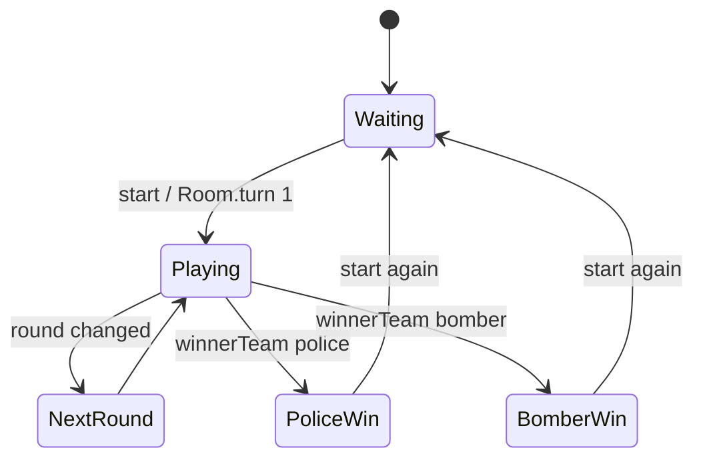

# timebomb 設計書

この文書は**現在の実装**を説明する。実装を変更したら同じ PR で更新する。

## 概要

TimeBomb は、プレイヤーが導線カードを開き、解除カードを必要数見つける前に爆弾カードを開くか時間切れになるかで勝敗が決まるゲーム。

- 最大人数: `TimeBombConst.DEFAULT_MAXUSERSIZE`
- 開始条件: 3人以上
- topic: `/topic/{roomId}/timebomb`
- サーバ状態の正本: `TimeBombRoom`
- フロント状態の入口: `timebombReducer`

timebomb は他4ゲームより古い通信形を維持しており、Room object を直接受ける経路と status 付き object を受ける経路が混在する。

## 実装ファイル

### Frontend

| 種別 | ファイル |
| --- | --- |
| page | `frontend/src/pages/timebomb/[roomId].tsx` |
| room hook | `frontend/src/features/timebomb/useTimebombRoom.ts` |
| reducer / state | `frontend/src/features/timebomb/reducer.ts`, `frontend/src/features/timebomb/types.ts` |
| tests | `frontend/src/features/timebomb/reducer.test.ts` |
| components | `frontend/src/features/timebomb/components/` |
| shared types | `frontend/src/type/timeBombRoom.ts`, `timeBombUser.ts`, `leadCards.ts`, `roomUserInfo.ts` |

### Backend

| 種別 | ファイル |
| --- | --- |
| room creation | `backend/src/main/java/com/boardgame/app/controller/MainController.java` |
| service | `backend/src/main/java/com/boardgame/app/service/TimeBombService.java` |
| game controller | `backend/src/main/java/com/boardgame/app/controller/TimeBombController.java` |
| room / user | `backend/src/main/java/com/boardgame/app/entity/timebomb/TimeBombRoom.java`, `TimeBombUser.java` |
| cards / request | `LeadCards.java`, `RoomUserInfo.java` |
| constants | `backend/src/main/java/com/boardgame/app/constclass/timebomb/TimeBombConst.java` |

## 状態モデル

### Backend State

| フィールド | 意味 |
| --- | --- |
| `userList` | 参加ユーザー。開始時に役職・手番が設定される |
| `turn` | 1始まりの手番番号 |
| `leadCardsList` | 導線カード一覧 |
| `winnerTeam` | `0`: 未決着、警察側、ボマー側 |
| `round` | ラウンド番号 |
| `releaseNo` | 解除成功数 |
| `limitTime` | 制限時間 |
| `secretFlg` | 役職秘匿モード |

### Frontend State

| 分類 | フィールド |
| --- | --- |
| room | `playerName` |
| message | `messageList` |
| game | `timeBombUserList`, `leadCardsList`, `round`, `turn`, `releaseNo`, `limitTime`, `secretFlg` |
| view | `startFlg`, `roundMessageFlg`, `endFlg`, `bommerFlg`, `policeFlg` |

## 通信

### 接続

- REST: `GET {AP_HOST}createroom`
- STOMP endpoint: `{AP_HOST}boardgame-endpoint`
- subscribe topic: `/topic/{roomId}/timebomb`

### Client -> Server

| 操作 | destination | payload | backend |
| --- | --- | --- | --- |
| 入室 | `/app/roomin` | `RoomUserInfo` | `TimeBombController.roomIn` |
| 開始 | `/app/start` | `RoomUserInfo` | `TimeBombController.start` |
| カードを開く | `/app/play` | `RoomUserInfo.cardIndex` | `TimeBombController.play` |
| アイコン変更 | `/app/changeIcon` | `RoomUserInfo.action` | `TimeBombController.changeIcon` |
| 時間切れ処理 | `/app/timebomb-limittime` | `SocketInfo.status=600`, `obj=turn` | `TimeBombController.limittime` |
| 制限時間変更 | `/app/timebomb-setlimittime` | `SocketInfo.status=900`, `obj=limitTime` | `TimeBombController.setTimeBombLimitTime` |
| 秘匿モード切替 | `/app/timebomb-changesecret` | `SocketInfo.status=800` | `TimeBombController.changeSecret` |

### Server -> Client

| 受信形 | status | payload | reducer の反映 | UI への影響 |
| --- | --- | --- | --- | --- |
| Room direct | なし | `TimeBombRoom` | `setData`。解除数増加時に「解除に成功」追記 | 盤面更新、開始/勝敗/ラウンド表示 |
| status object | `200` | message + Room | message 追記、`setData` | 同一名入室などの表示 |
| status object | `201` | `userList` | `timeBombUserList` 更新 | アイコン反映 |
| status object | `404` | message | `messageList` 追記 | エラー表示 |
| status object | `800` | `secretFlg` | `secretFlg` 更新 | 秘匿モード反映 |
| status object | `900` | `limitTime` | `limitTime` 更新 | 制限時間反映 |

Room direct 受信では、`turn === 1` なら `startFlg` が立ち、`winnerTeam` に応じて `policeFlg` / `bommerFlg` と `endFlg` が立つ。

## 状態遷移

## 副作用・UI 表示

| トリガ | 実装 | 内容 |
| --- | --- | --- |
| `startFlg` | `useTimebombRoom.ts` | body class の調整、先頭スクロール、一定時間後に `dismissStart` |
| `roundMessageFlg` | `useTimebombRoom.ts` | 一定時間後に `dismissRoundMessage` |
| `limitTime` / `turn` | `useTimebombRoom.ts` | 制限時間超過時に `/app/timebomb-limittime` |
| `winnerTeam` | reducer | 勝敗 modal 用 flag を立てる |

## 注意点

- topic は timebomb だけ `/topic/{roomId}/timebomb`。
- `useGameSocket.send` は payload を stringify するため、呼び出し側で stringify しない。
- `bommerFlg` は現行 state 名の綴りを維持している。
- timebomb は `SocketInfo` ではなく `RoomUserInfo` を使う送信経路がある。

## テスト・確認観点

- `frontend/src/features/timebomb/reducer.test.ts` で direct Room、status `200/201/404/800/900`、勝敗、ローカル action を検証。
- 手動確認は3人以上の複数タブで、入室、開始、カード選択、ラウンド遷移、勝敗、制限時間、秘匿モード、アイコン変更を確認する。

