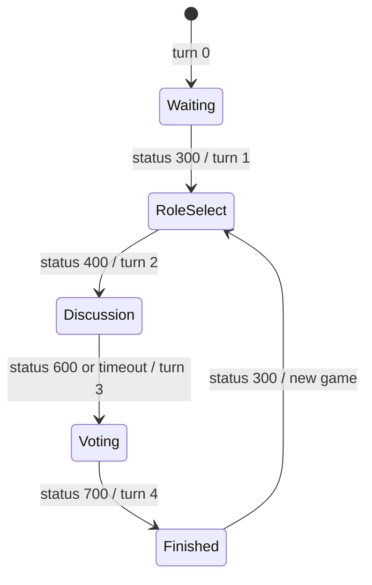

# werewolf 設計書

この文書は**現在の実装**を説明する。実装を変更したら同じ PR で更新する。

## 概要

Werewolf は、役職選択、議論、投票を通じて勝利チームを決めるワンナイト系の人狼ゲーム。

- 最大人数: 10
- 開始条件: 3人以上、参加者より多い役職設定、人狼系役職を含むこと
- topic: `/topic/{roomId}`
- サーバ状態の正本: `WerewolfRoom`
- フロント状態の入口: `werewolfReducer`

## 実装ファイル

### Frontend

| 種別 | ファイル |
| --- | --- |
| page | `frontend/src/pages/werewolf/[roomId].tsx` |
| room hook | `frontend/src/features/werewolf/useWerewolfRoom.ts` |
| reducer / state | `frontend/src/features/werewolf/reducer.ts`, `frontend/src/features/werewolf/types.ts` |
| tests | `frontend/src/features/werewolf/reducer.test.ts` |
| components | `frontend/src/features/werewolf/components/` |
| victory logic | `frontend/src/features/werewolf/victory.ts`, `frontend/src/features/werewolf/victory.test.ts` |
| shared types | `frontend/src/type/werewolf/` |

### Backend

| 種別 | ファイル |
| --- | --- |
| room creation | `backend/src/main/java/com/boardgame/app/controller/MainController.java` |
| common controller | `backend/src/main/java/com/boardgame/app/controller/GameController.java` |
| game controller | `backend/src/main/java/com/boardgame/app/controller/WereWolfController.java` |
| room / user / roll | `backend/src/main/java/com/boardgame/app/entity/werewolf/WerewolfRoom.java`, `WerewolfUser.java`, `WerewolfRoll.java` |
| role classes | `backend/src/main/java/com/boardgame/app/entity/werewolf/roll/` |
| constants | `backend/src/main/java/com/boardgame/app/constclass/werewolf/WereWolfConst.java` |

## 状態モデル

### Backend State

| フィールド | 意味 |
| --- | --- |
| `userList` | 参加ユーザー。手札、確定役職、投票先などを持つ |
| `turn` | `0`: 待機、`1`: 役職選択、`2`: 議論、`3`: 投票、`4`: 終了 |
| `rollList` | 今回使う役職リスト |
| `staticRollList` | 役職カスタマイズ用の全役職一覧 |
| `rollNoList` | 設定された役職番号リスト |
| `npcuser` | 余った役職を持つ NPC |
| `missingRollList` / `missingFlg` | 欠け役職情報 |
| `winteamList` | 勝利チーム一覧 |
| `limitTime` | 議論制限時間 |

### Frontend State

| 分類 | フィールド |
| --- | --- |
| room | `playerName`, `playerData`, `roomCode` |
| message | `messageList`, `chatList` |
| game | `userList`, `turn`, `winteamList`, `staticRollList`, `rollList`, `npcuser`, `limitTime`, `rollInfoList`, `counterMap` |
| view | `startFlg`, `modalRoll`, `modalOwnFlg`, `rollSelectTurnFlg`, `votingStartFlg`, `cutInNo`, `snipeSeq`, `resultFlg`, `ruleFlg`, `winMessage` |

`counterMap` は旧 DOM ベースの役職人数カウンタを reducer state 化したもの。

## 通信

### 接続

- REST: `GET {AP_HOST}createroom/werewolf`
- STOMP endpoint: `{AP_HOST}boardgame-endpoint`
- subscribe topic: `/topic/{roomId}`
- ルームコード入室: `GET {AP_HOST}roombycode/{roomCode}` → 200 で Room JSON / 404

### Client -> Server

| 操作 | destination | status | payload obj | backend |
| --- | --- | --- | --- | --- |
| 入室 | `/app/game-roomin` | `100` | `null` | `GameController.gameRoomIn` |
| 退出/キック | `/app/game-removeuser` | `130` | target userName | `GameController.gameRemoveUser` |
| チャット | `/app/game-chat` | `101` | `null` | `GameController.chat` |
| 役職設定 | `/app/werewolf-setrollregulation` | `150` | roll no list | `WereWolfController.werewolfSetRollRegulation` |
| 開始 | `/app/werewolf-init` | `300` | `null` | `WereWolfController.werewolfInit` |
| 役職選択 | `/app/werewolf-selectroll` | `400` | roll index | `WereWolfController.werewolfSelectRoll` |
| 議論アクション | `/app/werewolf-discussionaction` | `500` | target username list | `WereWolfController.werewolfDiscussionAction` |
| 制限時間変更 | `/app/game-setlimittime` | `550` | limit time | `GameController.setLimitTime` |
| 時間切れ処理 | `/app/game-dooverLimit` | `600` | turn | `GameController.doOverLimit` |
| アイコン変更 | `/app/game-changeIcon` | `650` | icon URL or JPEG data URL | `GameController.changeIcon` |
| 投票 | `/app/werewolf-voting` | `700` | target username | `WereWolfController.werewolfVoiting` |

### Server -> Client

| status | payload | reducer の反映 | UI への影響 |
| --- | --- | --- | --- |
| `100` | `WerewolfRoom` | `dataSet`、`limitTime`、`counterMap`、`rollInfoList` | 入室・役職設定状態を反映 |
| `101` | `chatList` | `chatList` 更新 | チャット欄更新 |
| `130` | `WerewolfRoom` | `dataSet`、`counterMap`、`rollInfoList` | 退出/キック反映。自分が `userList` から消えた場合はトップへ戻る |
| `150` | `WerewolfRoom` | `dataSet`、`counterMap`、`rollInfoList` | 役職カスタマイズ更新 |
| `200` | `WerewolfRoom` | status `100` と同等 | 同一名入室時の状態同期 |
| `300` | `WerewolfRoom` | `startFlg=true`、`ruleFlg=false`、`resultFlg=false`、`dataSet` | 開始 overlay |
| `400` | `WerewolfRoom` | `dataSet` | 役職選択進行 |
| `404` | message | `messageList` 追記 | エラー表示 |
| `500` | `WerewolfRoom` + action user no | `dataSet`、役職に応じて `cutInNo` / `snipeSeq` | 議論アクション演出 |
| `550` | limit time | `limitTime` 更新 | 制限時間反映 |
| `600` | `WerewolfRoom` | `dataSet` | 議論終了・投票移行 |
| `650` | `userList` | `userList` のみ更新 | プリセット URL / Data URL のアイコン反映 |
| `700` | `WerewolfRoom` | `dataSet`、`counterMap` | 投票状態・結果更新。hook が `winteamList` から `winMessage` を導出し、turn `4` なら `VictoryOverlay` 表示 |
| `998` | message | `userName` が自分なら `messageList` 追記 | 個人エラー |
| `999` | message | `messageList` 追記 | 全体エラー |

## 状態遷移

## 副作用・UI 表示

| トリガ | 実装 | 内容 |
| --- | --- | --- |
| `startFlg` | `useWerewolfRoom.ts` | 一定時間後に `dismissStart` |
| `turn` | `useWerewolfRoom.ts` | 役職選択・投票開始表示を制御 |
| `turn` / `winteamList` | `PhaseBackground.tsx` / `background.module.scss` | turn に応じ全画面背景を切替。0=待機(day)、1=役職選択(night)、2=議論、3=投票(いずれも夜系バリエーション)、4=勝利陣営色。ゲーム中(1〜3)は夜系で連続する |
| body クラス | `useBodyClass.ts` | 役職選択(`RollSelectTurn`)・役職モーダル(`ModalRollCard`)の body クラス付与(スクロールロック等)を共通フックに集約。旧 `document.*` 直接操作は廃止し、開閉は React state から導出する |
| `votingStartFlg` | `useWerewolfRoom.ts` / `VotingStart.tsx` | 一定時間後に `setVotingStartFlg(false)`。表示は開始演出(`WerewolfStart`)と同構造の `VotingStart` オーバーレイ(rose ティント) |
| `cutInNo` | `useWerewolfRoom.ts` | 役職アクション cut-in 表示 |
| `snipeSeq` | `useWerewolfRoom.ts` | 独裁者・暗殺者アクション時の効果音 |
| `chatList` | `useWerewolfRoom.ts` | チャット欄を下までスクロール |
| own user 検出 | reducer / hook | `playerData` 更新、初期アイコン自動設定 |
| 退出検知 | `useWerewolfRoom.ts` | 一度入室した後に自分が `userList` から消えたら `/` へ遷移 |
| アイコン変更 | `IconPicker.tsx`(共通) / `imageToIconDataUrl.ts` | 自分のアバターをクリックするとポップオーバーを表示(プリセット6個+シャッフル+「写真をアップロード」常設)。プリセットは相対 URL、アップロードは画像を 96px JPEG Data URL に変換し、40,000文字未満なら status `650` で送信。外側クリック / Esc で閉じ、画面端でははみ出しを自動補正する |
| フェーズ帯 | `TurnMessage.tsx` / `room.module.scss` | turn 1〜3 で「フェーズ名+残り時間+議論終了」を通常フローの sticky 帯として表示。帯自身が高さを持つためプレイヤーカードと重ならない。ゲーム中は `UserField` に `ingame` クラスを付け、浮遊アバター分の上マージンを確保する |
| 勝利演出 | `VictoryOverlay.tsx` / `victory.ts` | 勝利演出、結果表示、ロビー復帰の3段階を表示層だけで制御 |

## 注意点

- `WereWolfController` には `/app/werewolf-changeturn` があるが、現在の frontend hook からは直接使っていない。
- 議論アクション status `500` は `message` に action user の番号を入れて返す。reducer はこの番号から action user を引く。
- 役職設定エラーは `998` または `999` として返ることがある。
- 退出ボタンと他プレイヤーへのキックボタンは待機中(`turn=0`)と終了後(`turn=4`)のみ表示する。どちらも status `130` で対象 userName を送り、削除後の Room 全体を受けて state を同期する。
- `roomCode` は Room JSON から `WerewolfState.roomCode` に取り込み、待機中/終了後の `InvitePanel` で表示する。
- status `650` のアイコン `obj` は従来のプリセット URL に加えて、アップロード画像から生成した JPEG Data URL も許容する。バックエンドは文字列として保存し、`userList` を broadcast する。
- 勝利演出は reducer や backend の turn を変えず、overlay のローカル state で「勝利演出 → 結果表示 → 閉じる」を進める。閉じた後も turn `4` のロビー表示に戻る。
- ゲーム中画面(役職選択・議論・投票)と演出(cut-in・投票開始)は `tokens.scss` ベースの夜系デザインで統一している。色・フォント・余白はトークンを使い、role カードの陣営色ボーダーのみ `TEAM_COLOR_LIST` から tsx の inline style で付ける。
- `Countdown` は fakeartist と共用。werewolf の議論画面では `variant="night"`(夜背景向け配色)と `inline`(absolute 配置を解除しフェーズ帯内に置く)を渡す。prop 未指定(fakeartist)では従来表示のまま。
- プレイヤーカード(`userInfo.tsx`)は全員同一構造・同一高さ。名前ゾーンは2行分の固定高で、文字数に応じて4段階にフォントを縮小し(14文字以上は3行まで許容)最大20文字を全文表示する。自分のカードは上端バッジではなく「カード下辺中央の YOU タブ+ティール発光」で示す(上端はアバターと干渉するため)。
- アイコン選択の `HideoutIcon`(円形展開UI)は werewolf では使わず `components/common/IconPicker.tsx` に置き換えた。hideout は引き続き `HideoutIcon` を使用。

## テスト・確認観点

- `frontend/src/features/werewolf/reducer.test.ts` で status `100/101/130/150/300/400/500/550/600/650/700/998/999`、ローカル action を検証。
- 手動確認は3人以上の複数タブで、役職設定、開始、役職選択、議論アクション、時間切れ、投票、結果、チャット、退出/キック、アイコン変更を確認する。
