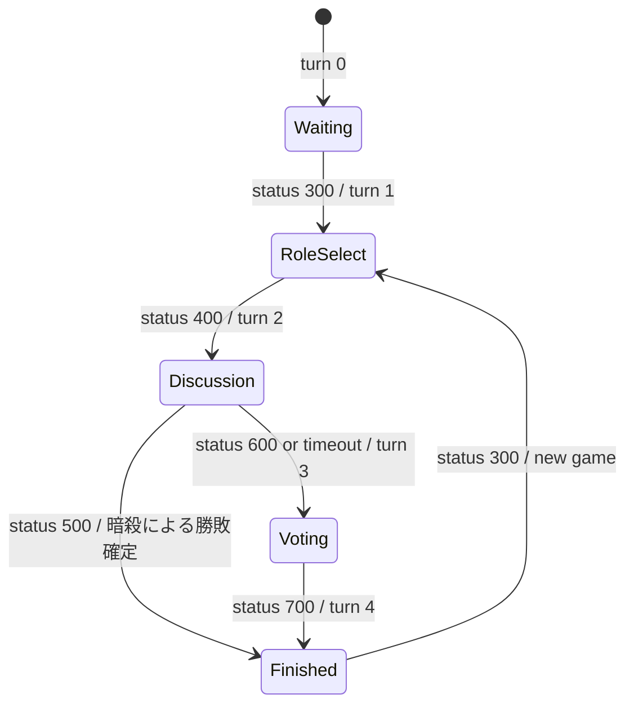

# werewolf 設計書

この文書は**現在の実装**を説明する。実装を変更したら同じ PR で更新する。

## 概要

Werewolf は、役職選択、議論、投票を通じて勝利チームを決めるワンナイト系の人狼ゲーム。

- 最大人数: 10
- 開始条件: 3人以上、参加者より多い役職設定、人狼系役職を含むこと
- topic: `/topic/{roomId}`
- サーバ状態の正本: `WerewolfRoom`
- フロント状態の入口: `werewolfReducer`

## 実装ファイル

### Frontend

| 種別 | ファイル |
| --- | --- |
| page | `frontend/src/pages/werewolf/[roomId].tsx` |
| room hook | `frontend/src/features/werewolf/useWerewolfRoom.ts` |
| reducer / state | `frontend/src/features/werewolf/reducer.ts`, `frontend/src/features/werewolf/types.ts` |
| tests | `frontend/src/features/werewolf/reducer.test.ts` |
| components | `frontend/src/features/werewolf/components/` |
| victory logic | `frontend/src/features/werewolf/victory.ts`, `frontend/src/features/werewolf/victory.test.ts` |
| lobby logic | `frontend/src/features/werewolf/lobby.ts`, `frontend/src/features/werewolf/lobby.test.ts` |
| shared types | `frontend/src/type/werewolf/` |

### Backend

| 種別 | ファイル |
| --- | --- |
| room creation | `backend/src/main/java/com/boardgame/app/controller/MainController.java` |
| common controller | `backend/src/main/java/com/boardgame/app/controller/GameController.java` |
| game controller | `backend/src/main/java/com/boardgame/app/controller/WereWolfController.java` |
| room / user / roll | `backend/src/main/java/com/boardgame/app/entity/werewolf/WerewolfRoom.java`, `WerewolfUser.java`, `WerewolfRoll.java` |
| role classes | `backend/src/main/java/com/boardgame/app/entity/werewolf/roll/` |
| constants | `backend/src/main/java/com/boardgame/app/constclass/werewolf/WereWolfConst.java` |

## 状態モデル

### Backend State

| フィールド | 意味 |
| --- | --- |
| `userList` | 参加ユーザー。手札、確定役職、投票先などを持つ |
| `turn` | `0`: 待機、`1`: 役職選択、`2`: 議論、`3`: 投票、`4`: 終了 |
| `rollList` | 今回使う役職リスト |
| `staticRollList` | 役職カスタマイズ用の全役職一覧 |
| `rollNoList` | 設定された役職番号リスト |
| `npcuser` | 余った役職を持つ NPC |
| `missingRollList` / `missingFlg` | 欠け役職情報 |
| `winteamList` | 勝利チーム一覧 |
| `limitTime` | 議論制限時間 |

### Frontend State

| 分類 | フィールド |
| --- | --- |
| room | `playerName`, `playerData`, `roomCode` |
| message | `messageList`(`{ text, kind: 'info' \| 'error' }` の配列), `chatList` |
| game | `userList`, `turn`, `winteamList`, `staticRollList`, `rollList`, `npcuser`, `limitTime`, `rollInfoList`, `counterMap`, `appliedCounterMap` |
| view | `startFlg`, `modalRoll`, `modalOwnFlg`, `rollSelectTurnFlg`, `votingStartFlg`, `cutInNo`, `snipeSeq`, `resultFlg`, `ruleFlg`, `winMessage` |

`counterMap` は旧 DOM ベースの役職人数カウンタを reducer state 化したもの。`appliedCounterMap` は「サーバが最後に受理した役職構成」で、Room を伴う status(`100`/`200`/`130`/`150`/`700`)でのみ `counterMap` と同時に更新する。ローカルの ± は `counterMap` だけを動かすため、両者の差分が「未反映(dirty)」を表す。判定は純粋関数 `isRollRegulationDirty`(`lobby.ts`)で行い、`counterMap` に残る 0 枚の key(± の往復で発生する)は「無し」として比較する。

## 通信

### 接続

- REST: `GET {AP_HOST}createroom/werewolf`
- STOMP endpoint: `{AP_HOST}boardgame-endpoint`
- subscribe topic: `/topic/{roomId}`
- ルームコード入室: `GET {AP_HOST}roombycode/{roomCode}` → 200 で Room JSON / 404

### Client -> Server

| 操作 | destination | status | payload obj | backend |
| --- | --- | --- | --- | --- |
| 入室 | `/app/game-roomin` | `100` | `null` | `GameController.gameRoomIn` |
| 退出/キック | `/app/game-removeuser` | `130` | target userName | `GameController.gameRemoveUser` |
| チャット | `/app/game-chat` | `101` | `null` | `GameController.chat` |
| 役職設定 | `/app/werewolf-setrollregulation` | `150` | roll no list | `WereWolfController.werewolfSetRollRegulation` |
| 開始 | `/app/werewolf-init` | `300` | `null` | `WereWolfController.werewolfInit` |
| 役職選択 | `/app/werewolf-selectroll` | `400` | roll index | `WereWolfController.werewolfSelectRoll` |
| 議論アクション | `/app/werewolf-discussionaction` | `500` | target username list | `WereWolfController.werewolfDiscussionAction` |
| 制限時間変更 | `/app/game-setlimittime` | `550` | limit time | `GameController.setLimitTime` |
| 時間切れ処理 | `/app/game-dooverLimit` | `600` | turn | `GameController.doOverLimit` |
| アイコン変更 | `/app/game-changeIcon` | `650` | icon URL or JPEG data URL | `GameController.changeIcon` |
| 投票 | `/app/werewolf-voting` | `700` | target username | `WereWolfController.werewolfVoiting` |

### Server -> Client

| status | payload | reducer の反映 | UI への影響 |
| --- | --- | --- | --- |
| `100` | `WerewolfRoom` | `dataSet`、`limitTime`、`counterMap`、`appliedCounterMap`、`rollInfoList` | 入室・役職設定状態を反映 |
| `101` | `chatList` | `chatList` 更新 | チャット欄更新 |
| `130` | `WerewolfRoom` | `dataSet`、`counterMap`、`appliedCounterMap`、`rollInfoList` | 退出/キック反映。自分が `userList` から消えた場合はトップへ戻る |
| `150` | `WerewolfRoom` | `dataSet`、`counterMap`、`appliedCounterMap`、`rollInfoList` | 役職カスタマイズ更新(受理された構成なので未反映状態が解消される) |
| `200` | `WerewolfRoom` | status `100` と同等 | 同一名入室時の状態同期 |
| `300` | `WerewolfRoom` | `startFlg=true`、`ruleFlg=false`、`resultFlg=false`、`dataSet` | 開始 overlay |
| `400` | `WerewolfRoom` | `dataSet` | 役職選択進行 |
| `404` | message | `messageList` 追記(`kind: 'error'`) | エラー表示 |
| `500` | `WerewolfRoom` + action user no | `dataSet`、役職に応じて `cutInNo` / `snipeSeq` | 議論アクション演出。暗殺対象が勝敗確定条件に該当する場合は、この status で `turn=4` / `winteamList` も反映 |
| `550` | limit time | `limitTime` 更新 | 制限時間反映 |
| `600` | `WerewolfRoom` | `dataSet` | 議論終了・投票移行 |
| `650` | `userList` | `userList` のみ更新 | プリセット URL / Data URL のアイコン反映 |
| `700` | `WerewolfRoom` | `dataSet`、`counterMap`、`appliedCounterMap` | 投票状態・結果更新。ページが `winteamList` から `victoryMessage` を同フレームで導出し、turn `4` なら遅延なく `VictoryOverlay` 表示(ロビーを一瞬経由しない) |
| `998` | message | `userName` が自分なら `messageList` 追記(`kind: 'error'`) | 個人エラー |
| `999` | message | `messageList` 追記(`kind: 'error'`) | 全体エラー |

## 状態遷移

```mermaid
stateDiagram-v2
    [*] --> Waiting: turn 0
    Waiting --> RoleSelect: status 300 / turn 1
    RoleSelect --> Discussion: status 400 / turn 2
    Discussion --> Voting: status 600 or timeout / turn 3
    Discussion --> Finished: status 500 / 暗殺による勝敗確定
    Voting --> Finished: status 700 / turn 4
    Finished --> RoleSelect: status 300 / new game
```

### 暗殺者による勝敗判定

暗殺者が議論中に対象を殺害した場合、対象へ `punishmentFlg=true`、`votingAbleFlg=false`、`votingSize=0` を設定する。対象の役職と、ゲーム内にてるてるが配役されているかによって、次のように処理する。

| 暗殺対象 | 動作 |
| --- | --- |
| てるてる | その場で終了。`turn=4`、`winteamList=[TEAM_NO_TERUTERU]` |
| 人狼 / 白狼 + てるてるなし | その場で終了。`turn=4`、`winteamList=[TEAM_NO_VILLAGER]` |
| 人狼 / 白狼 + てるてるあり | 終了せず、議論・投票を継続。暗殺対象だけが死亡扱いになり、`turn` と `winteamList` は更新しない |
| その他 | 終了せず、議論・投票を継続。暗殺対象は議論・投票に参加できない |

人狼系は `ROLL_NO_WEREWOLF` / `ROLL_NO_WHITEWEREWOLF` で判定する。付き人など、能力によって `teamNo` が変わる役職は人狼系として扱わない。

「てるてるあり」は、現在のゲーム状態で `userList` または `npcuser` に `ROLL_NO_TERUTERU` が配役されていることを指す。役職設定には含まれていても、今回のゲームで役欠けになったてるてるは「てるてるなし」として扱う。この結果、暗殺後にゲームが終了するか継続するかから、てるてるが役欠けだったかを全員が推測できる。

てるてるありで人狼 / 白狼を暗殺した場合、後続の投票でてるてるが最多票になればてるてる勝利、てるてるが処刑されなければ暗殺済みの人狼系が残るため村人陣営勝利となる。暗殺直後の即時終了では投票数から追加の `punishmentFlg` を設定せず、暗殺対象だけを死亡扱いにする。

怪盗がその後 NPC と役職交換する場合は、怪盗の既存能力をそのまま適用する。暗殺対象が NPC だった場合も、役職交換による役職・死亡フラグの引き継ぎは許容する。

## 副作用・UI 表示

| トリガ | 実装 | 内容 |
| --- | --- | --- |
| `startFlg` | `useWerewolfRoom.ts` | 一定時間後に `dismissStart` |
| `turn` | `useWerewolfRoom.ts` | 役職選択・投票開始表示を制御 |
| `turn` / `winteamList` | `PhaseBackground.tsx` / `background.module.scss` | turn に応じ全画面背景を切替。0=待機(dusk クラス: 淡い空色→桜色の白昼グラデーション)、1=役職選択(night)、2=議論、3=投票(いずれも夜系バリエーション)、4=夜明け(dawn)+勝利陣営のグラデーションティント(wolf=rose / village=teal / third=gold)。シーン間は background transition で昼夜が切り替わるように繋がる |
| body クラス | `useBodyClass.ts` | 役職選択(`RollSelectTurn`)・役職モーダル(`ModalRollCard`)の body クラス付与(スクロールロック等)を共通フックに集約。旧 `document.*` 直接操作は廃止し、開閉は React state から導出する |
| `votingStartFlg` | `useWerewolfRoom.ts` / `VotingStart.tsx` | 一定時間後に `setVotingStartFlg(false)`。表示は開始演出(`WerewolfStart`)と同構造の `VotingStart` オーバーレイ(rose ティント) |
| `cutInNo` | `useWerewolfRoom.ts` | 役職アクション cut-in 表示 |
| `snipeSeq` | `useWerewolfRoom.ts` | 独裁者・暗殺者アクション時の効果音 |
| `chatList` | `useWerewolfRoom.ts` | チャット欄を下までスクロール |
| own user 検出 | reducer / hook | `playerData` 更新、初期アイコン自動設定 |
| 退出検知 | `useWerewolfRoom.ts` | 一度入室した後に自分が `userList` から消えたら `/` へ遷移 |
| アイコン変更 | `IconPicker.tsx`(共通) / `imageToIconDataUrl.ts` | 自分のアバターをクリックするとポップオーバーを表示(プリセット6個+シャッフル+「写真をアップロード」常設)。プリセットは相対 URL、アップロードは画像を 96px JPEG Data URL に変換し、40,000文字未満なら status `650` で送信。外側クリック / Esc で閉じ、画面端でははみ出しを自動補正する |
| フェーズ帯 | `TurnMessage.tsx` / `room.module.scss` | turn 1〜3 で「フェーズ名+残り時間+議論終了」を通常フローの sticky 帯として表示。帯自身が高さを持つためプレイヤーカードと重ならない。ゲーム中は `UserField` に `ingame` クラスを付け、浮遊アバター分の上マージンを確保する |
| 勝利演出 | `VictoryOverlay.tsx` / `victory.ts` | 3幕構成(`VictoryAct`: reveal=種明かし → verdict=勝敗発表 → result=巻物結果 → closed)。幕遷移は純粋関数 `nextVictoryAct` で行い、表示層のローカル state だけで制御。第1幕 `RoleRevealAct` はセンターステージ形式: `revealOrder`(人狼陣営を最後に回す)の順で中央に1人ずつ「アイコン+名前+キャラカード(フリップ開示)+投票先」を表示し、死亡者は銃声(`/se/snip.mp3`)+画面フラッシュ+銃痕(SVG)+モノクロ化の銃撃演出を挟む。開示済みは下部の列に縮小して並び、死亡者は銃痕が残る。フェーズは enter→open→(死亡者のみ shot)の3段階で、タップ短縮・自動送り・スキップ対応。verdict 以降も `RoleRevealAct` は `finished` プロップで最終盤面(全員開示済みの列)を残し、一枚絵の上で演出を続ける。第2幕 `VerdictBanner` は陣営色の「〇〇の勝利」バナーを盤面上に重ね(4秒 or タップで自動進行、result 中は縮小して残す)、第3幕 `ResultModal` は結果一覧(役職・投票先・得票・勝敗)+ロビー復帰ボタンを下からスライドインするモーダルで出す。スキップは verdict へ飛ぶ(盤面+勝敗発表は飛ばさない) |
| 死亡者マーカー | `isDeadUser` | `roll.punishmentFlg`(処刑・銃撃)から死亡を判定。種明かしは銃痕(RoleRevealAct 内 `BulletHole`)+モノクロ化、結果一覧は「散」タグ+モノクロ化 |
| 前回結果の再表示 | `[roomId].tsx` / `ResultModal.tsx`(`resultFlg`) | 終了後ロビー(turn `4` かつ `winteamList` あり)ではヘッダーの状態バッジ左に「前回の結果」ボタンを出し、`resultFlg` で `ResultModal` を単体表示する(閉じるラベルは `returnLabel="閉じる"`)。勝利演出とは独立に開閉でき、次の status `300` で `resultFlg` が下りボタンも消える。state はクライアント保持のためリロードすると出ない |
| 待機画面構成 | `[roomId].tsx` / `InvitePanel.tsx` / `StatusCard.tsx` / `MenuPanel.tsx` | ロビーは「ヘッダー(タイトル+前回結果ボタン+状態バッジ) → 招待カード+開始ステータスカードの2カラム(モバイルは縦積み) → 集いし者たち(プレイヤー) → お品書き(ダークパネル) → 不足メッセージ → 下部固定バー(退出 / GAME START)」の構成。招待カードは `hero.webp` を右側に敷き、ルーム番号・URL コピー・遊び方を持つ。開始ステータスカードは蝋燭列(max 10・min 3、入室数だけ点灯)+入室人数+カード内 GAME START |
| 開始条件表示 | `lobby.ts`(`lobbyReadiness`) | 3人以上 / 役職合計 > 参加人数 / 人狼陣営(teamNo=1)を含む、の3条件を判定。不足メッセージをお品書き直下のエラーパネルに表示し、GAME START(ステータスカード内・下部バーとも)を `disabled` にする。ヘッダーの状態バッジも readiness で「参加待ち/開始できます」を切り替える |
| 待機カード演出 | `userInfo.tsx` / `userinfo.module.scss` | ロビー時のみ登場アニメ(norenIn)と、他人アバタータップの「つつき」揺れ(ローカル state のみ・通信なし)。ロビー中はカード枠をニュートラルにし、プレイヤーカラーはアバターの輪(CSS 変数 `--player-color`)で示す。`userList` 先頭のプレイヤーに「主」バッジを表示 |

## 注意点

- `WereWolfController` には `/app/werewolf-changeturn` があるが、現在の frontend hook からは直接使っていない。
- 議論アクション status `500` は `message` に action user の番号を入れて返す。reducer はこの番号から action user を引く。
- 暗殺者の status `500` は、てるてる暗殺または「てるてるなしで人狼 / 白狼を暗殺」した場合に `turn=4` / `winteamList` を含む。てるてるありで人狼 / 白狼を暗殺した場合は `turn=2` / `winteamList=[]` のまま議論を継続する。
- 役職設定エラーは `998` または `999` として返ることがある。
- 退出ボタンと他プレイヤーへのキックボタンは待機中(`turn=0`)と終了後(`turn=4`)のみ表示する。どちらも status `130` で対象 userName を送り、削除後の Room 全体を受けて state を同期する。
- `roomCode` は Room JSON から `WerewolfState.roomCode` に取り込み、待機中/終了後の `InvitePanel` で表示する。
- status `650` のアイコン `obj` は従来のプリセット URL に加えて、アップロード画像から生成した JPEG Data URL も許容する。バックエンドは文字列として保存し、`userList` を broadcast する。
- 勝利演出は reducer や backend の turn を変えず、overlay のローカル state で「種明かし → 勝敗発表 → 結果モーダル → 閉じる」の3幕を進める(`nextVictoryAct`)。種明かしの盤面は最後まで画面に残る。閉じた後も turn `4` の夜明けロビー表示に戻る。`ResultModal` は z-index 50 で、ロビー下部固定バー(z-index 40)より前に出る(勝利演出中は `.overlay`(z-index 60)の重ね合わせ文脈に閉じるため影響しない)。
- 暗殺による即時終了では status `500` の Room 更新で `turn=4` / `winteamList` を受け取り、既存の勝利演出へ進む。暗殺直後は対象の `punishmentFlg` だけを死亡情報として引き継ぎ、暗殺対象以外の役職へ投票数 0 を理由に `punishmentFlg` を追加しない。てるてるありで人狼系を暗殺した場合は turn `2` のまま継続し、通常の status `600` / `700` 経路で結果を確定する。
- 待機中の桜パーティクルは `SakuraParticles` の `ambient` モード(桜色 palette)。勝利演出中は `celebration` に譲る。
- お品書き(`MenuPanel`)はダークパネル。役職はカード画像ではなく漢字一字バッジ付きチップ(`RollCustomize` の `ROLL_KANJI`)で並べ、名前タップで説明モーダルを開く。±はローカル state 更新のみで「設定」ボタン(status `150`)で送信、プリセット選択は即送信という従来動線を維持。送信していないあいだ(dirty)は「設定」ボタンを金の灯で淡く点滅させ「未反映」ラベルを添える(`prefers-reduced-motion: reduce` では点滅を止め静的な金枠にする)。dirty は `lobbyReadiness` の不足メッセージにも加わるため、GAME START(`StatusCard`・下部固定バーとも)は「設定」を押すまで disabled になる。backend が status `998` で構成を拒否した場合は `appliedCounterMap` が更新されないので、点滅と GAME START の抑止が残り続ける。議論時間はなし/3分/5分/7分のピル(送信値 0/180/300/420 は不変)。
- ゲーム中画面(役職選択・議論・投票)と演出(cut-in・投票開始)は `tokens.scss` ベースの夜系デザインで統一している。色・フォント・余白はトークンを使い、role カードの陣営色ボーダーのみ `TEAM_COLOR_LIST` から tsx の inline style で付ける。
- `Countdown` は fakeartist と共用。werewolf の議論画面では `variant="night"`(夜背景向け配色)と `inline`(absolute 配置を解除しフェーズ帯内に置く)を渡す。prop 未指定(fakeartist)では従来表示のまま。
- プレイヤーカード(`userInfo.tsx`)は全員同一構造・同一高さ。名前ゾーンは2行分の固定高で、文字数に応じて4段階にフォントを縮小し(14文字以上は3行まで許容)最大20文字を全文表示する。自分のカードは上端バッジではなく「カード下辺中央の YOU タブ+ティール発光」で示す(上端はアバターと干渉するため)。
- アイコン選択の `HideoutIcon`(円形展開UI)は werewolf では使わず `components/common/IconPicker.tsx` に置き換えた。hideout は引き続き `HideoutIcon` を使用。

## テスト・確認観点

- `frontend/src/features/werewolf/reducer.test.ts` で status `100/101/130/150/300/400/500/550/600/650/700/998/999`、ローカル action、`appliedCounterMap` の同期(Room 付き status では更新、± と `998` では据え置き)を検証。
- `frontend/src/features/werewolf/lobby.test.ts` で `isRollRegulationDirty`(0 枚 key の扱いを含む)と `lobbyReadiness`(未反映時に ready にならないこと)を検証。
- `backend/src/test/java/com/boardgame/app/entity/werewolf/WerewolfRoomTest.java` で、暗殺対象が人狼 / 白狼 / てるてるの場合の即時終了・継続、対象以外の死亡フラグが増えないこと、通常投票の判定を検証する。
- 手動確認は3人以上の複数タブで、役職設定、開始、役職選択、議論アクション、時間切れ、投票、結果、チャット、退出/キック、アイコン変更を確認する。
- 役職構成については「± 直後に設定ボタンが点滅し GAME START が押せないこと」「『設定』押下で解消すること」「プリセット選択では点滅しないこと」も確認する。
