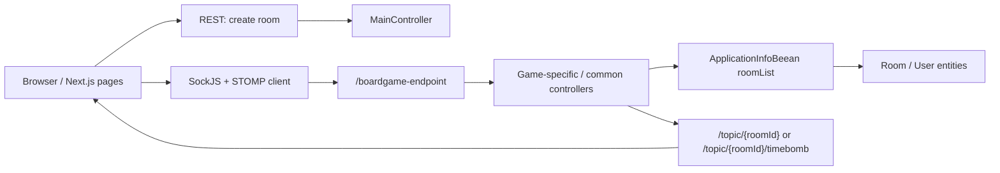

# 全体アーキテクチャ

BoardGame は、5つのオンラインボードゲームを提供するモノレポ。`frontend/` は Next.js、`backend/` は Spring Boot で構成する。

ゲーム識別子:

- `timebomb`
- `werewolf`
- `hideout`
- `decrypt`
- `fakeartist`

## システム構成

## リポジトリ構成

| ディレクトリ | 役割 |
| --- | --- |
| `frontend/` | Next.js 15 / React 19 / TypeScript。ゲームページ、feature reducer、STOMP 接続フック、UI コンポーネント |
| `backend/` | Spring Boot 2.4 / Java 11。ルーム作成 REST、SockJS/STOMP controller、Room/User entity |
| `docs/` | 現在の設計、future 側の未完了タスク、必要に応じた進行中計画 |

## リポジトリ運用

アクティブなリポジトリは main / future の2本に整理する。この作業ツリーは future 側。main リポジトリは安定版・本番反映を担当し、future リポジトリは次期 UI、設計整理、モダナイズを進める。future で API / WebSocket 契約を変える場合も、main へ昇格する前に frontend / backend / docs の互換性を確認する。

## 実行時の基本フロー

1. トップページから REST でルームを作成する。
2. フロントは `pages/<game>/[roomId].tsx` を開く。
3. ページは `features/<game>/use<Game>Room.ts` を呼び、`useGameSocket` 経由で STOMP topic を購読する。
4. ユーザー操作は `/app/*` destination に送信される。
5. バックエンド controller は `ApplicationInfoBeean` から Room を取り出し、Room entity のメソッドで状態を更新する。
6. controller は Room または `SocketInfo` を `/topic/*` に publish する。
7. フロントの reducer が status / payload を state に反映し、UI が再描画される。

## ゲーム別の実装入口

| ゲーム | Frontend feature | Backend controller | Backend room | 設計書 |
| --- | --- | --- | --- | --- |
| timebomb | `frontend/src/features/timebomb/` | `TimeBombController` | `TimeBombRoom` | [games/timebomb.md](games/timebomb.md) |
| werewolf | `frontend/src/features/werewolf/` | `WereWolfController` + `GameController` | `WerewolfRoom` | [games/werewolf.md](games/werewolf.md) |
| hideout | `frontend/src/features/hideout/` | `HideoutController` + `GameController` | `HideoutRoom` | [games/hideout.md](games/hideout.md) |
| decrypt | `frontend/src/features/decrypt/` | `DecryptController` + `GameController` | `DecryptRoom` | [games/decrypt.md](games/decrypt.md) |
| fakeartist | `frontend/src/features/fakeartist/` | `FakeArtistController` + `GameController` | `FakeArtistRoom` | [games/fakeartist.md](games/fakeartist.md) |

## 設計上の境界

- Room entity がサーバ側ゲーム状態の正本。
- Frontend reducer はサーバ状態を UI 用 state に写し、ローカル UI フラグも同じ reducer で扱う。
- `SocketInfo.status` は reducer の分岐キー。status の意味はゲームごとに異なるため、ゲーム別設計書で管理する。
- timebomb だけ topic が `/topic/{roomId}/timebomb` で、他4ゲームは `/topic/{roomId}`。
- バックエンドの destination / topic / payload 互換性を変える場合は、frontend、backend、`communication.md`、該当ゲーム設計書を同じ PR で更新する。
